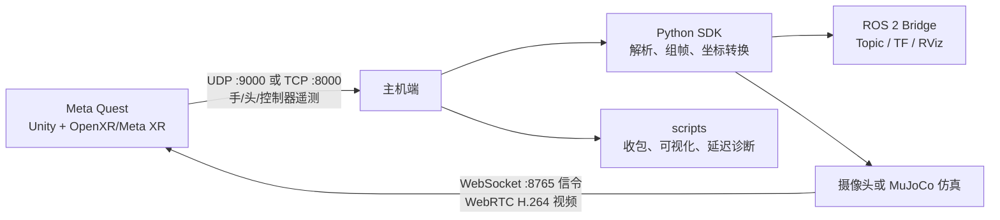

# Hand Tracking Streamer

Hand Tracking Streamer（HTS）是一套面向机器人遥操作、动作捕捉和 XR 实验的 Meta Quest 手部追踪工程。Quest 应用采集手腕、21 个手部关键点、头部位姿或 Touch 控制器输入，通过 UDP/TCP 发往主机；主机可使用 Python SDK、调试脚本或 ROS 2 桥接包消费数据。Python 端还可通过 WebRTC 将摄像头或仿真画面回传到头显。

## README 导航

- [工程总览与快速开始（本文）](README.md)
- [Unity / Quest 应用](hand_tracking_streamer/README.md)
- [Python SDK](hand-tracking-sdk-main/README.md)
- [ROS 2 桥接包](hand-tracking-sdk-ros2-main/README.md)
- [连接方式与数据协议](CONNECTIONS.md)
- [隐私说明](PRIVACY.md)
- [许可证](LICENSE)
- [视频回传示例](hand-tracking-sdk-main/examples/video/README.md)

## 工程框架



核心包如下：

| 目录 | 技术栈 | 作用 |
|---|---|---|
| `hand_tracking_streamer/` | Unity 6000.0.65f1、OpenXR、Meta XR SDK | Quest 端采集、可视化、网络发送和视频接收 |
| `hand-tracking-sdk-main/` | Python 3.10+ | 协议解析、UDP/TCP 客户端、帧组装、坐标转换、可视化与 WebRTC 视频服务 |
| `hand-tracking-sdk-ros2-main/` | ROS 2、Python | 将 SDK 帧发布为 ROS Topic、TF、Marker 和诊断信息 |
| `scripts/` | Python 3.13、NumPy、Matplotlib | 不依赖 SDK 的基础收包、绘图和到达间隔诊断工具 |

数据默认采用 Unity 左手坐标系。接入机器人或其他右手坐标系前，应使用 SDK 的转换函数，或由 ROS 2 桥接包完成坐标归一化。完整字段定义见 [CONNECTIONS.md](CONNECTIONS.md)。

## 环境要求

按实际使用路径安装所需环境，无需一次安装全部组件。

| 场景 | 必需环境或软件包 |
|---|---|
| 直接运行 Quest 应用 | Meta Quest 3/3S；侧载时需要 ADB 和已开启的开发者模式 |
| 构建 Quest 应用 | Unity `6000.0.65f1`，Android Build Support、SDK、NDK、OpenJDK |
| 根目录调试脚本 | Python `>=3.13`；绘图需要 `numpy>=2.4.2`、`matplotlib>=3.10.8` |
| Python SDK | Python `>=3.10`；基础依赖 `lark>=1.3.1`、`pyyaml>=6.0.3` |
| ROS 2 桥接 | ROS 2 Jazzy（主要测试版本；Humble/Kilted 为兼容目标）、`colcon`、Python SDK |

建议安装 [uv](https://docs.astral.sh/uv/) 管理 Python 环境，也可使用 `venv + pip`。

## 快速开始

### 1. 安装 Quest 应用

仓库根目录已提供 `hand_tracking_streamer.apk`。连接已开启开发者模式的 Quest 后执行：

```powershell
adb devices
adb install -r .\hand_tracking_streamer.apk
```

也可以从 Meta Quest Store 安装正式版本。应用内选择 Hands 或 Controller Input 模式，并配置协议、主机 IP、端口和左右手。

### 2. 在主机启动接收端

推荐先使用无需第三方依赖的收包脚本验证网络。

UDP（Quest 与主机位于同一局域网）：

```powershell
python .\scripts\sockets.py --protocol udp --host 0.0.0.0 --port 9000
```

有线 TCP（连接 USB 后，先建立 ADB reverse）：

```powershell
adb reverse tcp:8000 tcp:8000
adb reverse --list
python .\scripts\sockets.py --protocol tcp --host localhost --port 8000
```

随后在 Quest 应用中启动串流。无线 TCP 时，将 Quest 目标地址改为主机局域网 IPv4，主机监听地址使用 `0.0.0.0`。

### 3. 运行基础可视化

使用 uv：

```powershell
uv sync
uv run python .\scripts\visualizer.py --protocol udp --host 0.0.0.0 --port 9000 --show-fingers
```

或使用 pip：

```powershell
python -m venv .venv
.\.venv\Scripts\Activate.ps1
python -m pip install numpy matplotlib
python .\scripts\visualizer.py --protocol udp --host 0.0.0.0 --port 9000 --show-fingers
```

其他诊断命令：

```powershell
# 只统计每秒消息数
python .\scripts\sockets.py --protocol udp --port 9000 --tally

# 统计消息到达间隔
python .\scripts\interarrival.py --protocol udp --host 0.0.0.0 --port 9000
```

### 4. 使用 Python SDK

从本仓库安装开发版本并输出组装后的帧：

```powershell
cd .\hand-tracking-sdk-main
python -m pip install -e ".[visualization]"
python .\examples\stream_frames.py --transport tcp_server --host 0.0.0.0 --port 8000
```

实时三维可视化：

```powershell
python .\examples\visualize_rerun.py --transport tcp_server --host 0.0.0.0 --port 8000 --show-coordinate-frames
```

SDK 的可选依赖、API 示例和视频回传方式见 [Python SDK README](hand-tracking-sdk-main/README.md)。

### 5. 使用 ROS 2

以下命令在已加载 ROS 2 环境的 Bash 中，从仓库根目录执行：

```bash
python3 -m pip install -e ./hand-tracking-sdk-main
colcon build --base-paths ./hand-tracking-sdk-ros2-main \
  --symlink-install --packages-select hand_tracking_sdk_ros2
source install/setup.bash
ros2 launch hand_tracking_sdk_ros2 view_hands.launch.py
```

默认 ROS 配置为 TCP Server `0.0.0.0:8000`。仅启动桥接节点时运行：

```bash
ros2 launch hand_tracking_sdk_ros2 bridge.launch.py
```

详细 Topic、参数和验证命令见 [ROS 2 包 README](hand-tracking-sdk-ros2-main/README.md)。

## 从源码构建 APK

用 Unity Hub 安装 Unity `6000.0.65f1` 及 Android Build Support（包含 SDK、NDK、OpenJDK），然后将 `hand_tracking_streamer/` 作为项目打开，切换到 Android 平台并执行 Build。

Windows 也可从仓库根目录批量构建：

```powershell
& "C:\Program Files\Unity\Hub\Editor\6000.0.65f1\Editor\Unity.exe" `
  -batchmode -quit `
  -projectPath "$PWD\hand_tracking_streamer" `
  -executeMethod CodexAndroidBuild.BuildApk `
  -apkPath "$PWD\hand_tracking_streamer.apk" `
  -logFile "$PWD\unity-build.log"
```

仓库中的 `install-unity-android*.ps1` 含机器绝对路径，仅用于当前 Windows 环境的离线工具链准备，不应直接作为通用安装脚本运行。

## 常用端口与网络配置

| 链路 | 默认端口 | 说明 |
|---|---:|---|
| Quest → 主机 UDP | `9000` | Quest 可广播至 `255.255.255.255`，主机绑定 `0.0.0.0` |
| Quest → 主机 TCP | `8000` | 有线模式使用 `adb reverse`；无线模式填写主机局域网 IP |
| 主机 → Quest 视频信令 | `8765` | WebSocket 信令地址为 `ws://<主机IP>:8765`，媒体通过 WebRTC 传输 |

请允许相应端口通过主机防火墙。一个端口同一时间只能由一个接收进程监听，运行 SDK、ROS 2 或调试脚本前应关闭其他占用同端口的程序。

## 测试

Python SDK：

```powershell
cd .\hand-tracking-sdk-main
uv sync --all-extras
uv run pytest
uv run ruff check .
```

ROS 2 包：

```bash
colcon test --packages-select hand_tracking_sdk_ros2 --event-handlers console_direct+
colcon test-result --verbose --all
```

## 常见问题

- `adb devices` 未显示设备：确认 Quest 已开启开发者模式，并在头显中允许 USB 调试。
- UDP 无数据：确认两端处于同一局域网、目标 IP/端口一致，并检查防火墙和 AP 客户端隔离。
- TCP 无法连接：先启动主机 TCP Server；有线模式还需执行 `adb reverse tcp:8000 tcp:8000`。
- 坐标方向不正确：HTS 原始数据是 Unity 左手坐标系，使用 SDK/ROS 2 的坐标转换后再消费。
- RViz 有 Topic 但无画面：使用 `view_hands.launch.py`，它会为 RViz 将 QoS 覆盖为 `reliable`。

## 许可证与引用

本工程采用 [Apache License 2.0](LICENSE)。科研或项目中使用时，请参考 [CITATION.cff](CITATION.cff) 进行引用。
