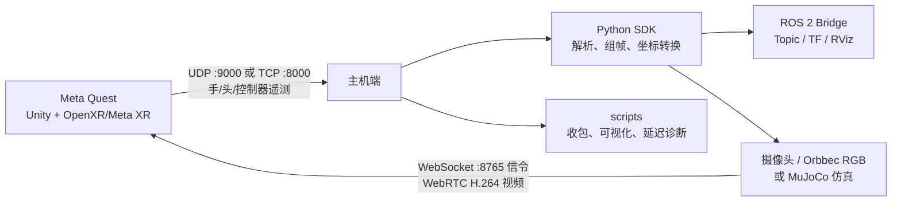

# Hand Tracking Streamer

Hand Tracking Streamer（HTS）是一套面向机器人遥操作、动作捕捉和 XR 实验的 Meta Quest 手部追踪工程。Quest 应用采集手腕、21 个手部关键点、头部位姿或 Touch 控制器输入，通过 UDP/TCP 发往主机；主机可使用 Python SDK、调试脚本或 ROS 2 桥接包消费数据。Python 端还可通过 WebRTC 将摄像头或仿真画面回传到头显。

## README 导航

- [工程总览与快速开始（本文）](README.md)
- [已实现功能（SDK / ROS 2）](#已实现功能)
- [Unity / Quest 应用](hand_tracking_streamer/README.md)
- [Python SDK](hand-tracking-sdk-main/README.md)
- [ROS 2 桥接包](hand-tracking-sdk-ros2-main/README.md)
- [连接方式与数据协议](CONNECTIONS.md)
- [隐私说明](PRIVACY.md)
- [许可证](LICENSE)
- [视频回传示例](hand-tracking-sdk-main/examples/video/README.md)

## 工程框架



核心包如下：

| 目录 | 技术栈 | 作用 |
|---|---|---|
| `hand_tracking_streamer/` | Unity 6000.0.65f1、OpenXR、Meta XR SDK | Quest 端采集、可视化、网络发送和视频接收 |
| `hand-tracking-sdk-main/` | Python 3.10+ | **底层 SDK**：协议解析、UDP/TCP、帧组装、坐标转换、可视化与 WebRTC 视频 |
| `hand-tracking-sdk-ros2-main/` | ROS 2、Python | **基于上述 SDK 的 ROS 2 封装**：内部调用 `HTSClient` 收帧，再发布 Topic/TF/Marker/诊断 |
| `scripts/` | Python 3.13、NumPy、Matplotlib | 不依赖 SDK 的基础收包、绘图和到达间隔诊断工具 |

依赖关系（不要把 ROS 2 包当成另一套解析器）：

```text
hand_tracking_streamer (Quest APK)
        │  UDP/TCP 遥测
        ▼
hand-tracking-sdk-main  (hand_tracking_sdk：HTSClient / HandFrame / ControllerFrame / …)
        │  复用传输、解析、组帧
        ▼
hand-tracking-sdk-ros2-main  (hand_tracking_sdk_ros2：bridge_node → Topic / TF / RViz)
```

`FrameRuntime`（`hand-tracking-sdk-ros2-main/.../runtime.py`）在节点内直接构造 `HTSClient`；`adapters.py` 只做 SDK 帧 → ROS 消息映射。因此安装 ROS 2 包前，须先把 `hand-tracking-sdk` 装进 **与 `ros2` 相同的 Python**。视频回传仍只走 Python SDK 的 `VideoService`，ROS 2 包不打包视频。

数据默认采用 Unity 左手坐标系。接入机器人或其他右手坐标系前，应使用 SDK 的转换函数，或由 ROS 2 桥接包完成坐标归一化。完整字段定义见 [CONNECTIONS.md](CONNECTIONS.md)。

## 已实现功能

下列为当前仓库**已落地**能力（以代码为准）。Quest 侧采集与发送见 [Unity README](hand_tracking_streamer/README.md)；线协议见 [CONNECTIONS.md](CONNECTIONS.md)。

### 能力总览

| 能力 | Quest 应用 | Python SDK (`hand-tracking-sdk`) | ROS 2 (`hand_tracking_sdk_ros2`) |
|---|---|---|---|
| 手部手腕 + 21 关键 | Hands 模式发送 | `HandFrame` / `get_joint` / `get_finger` | `/hands/*/wrist_pose`、`/hands/*/landmarks`、`/hands/*/markers`、手腕 TF |
| 头部位姿 | Head Pose 开关 | `HeadFrame` | `/head/pose`、TF `head` |
| 控制器 Pointer Pose | Controller Input 模式 | `ControllerFrame.pose` | `/controllers/*/pose`、TF `*_controller_endpoint` |
| 控制器轴与按键 | 同上 | `ControllerFrame.input`（见下表） | `/controllers/*/input`（`sensor_msgs/Joy`） |
| UDP / TCP 传输 | 协议菜单 | `TransportMode.UDP\|TCP_SERVER\|TCP_CLIENT` | 参数 `transport_mode` / `host` / `port` |
| 坐标转换 | Unity 左手原始输出 | `convert_*`、`unity_left_to_flu_*` 等 | 桥接内固定映射为 FLU |
| 遥操作辅助 | — | `pinch_distance` / `grip_value` / `extract_arm_target` / `finger_curl_angles` | —（不发布） |
| Rerun / RViz 可视化 | 头显内骨架/射线 | `RerunVisualizer` | `view_hands.launch.py` + Marker |
| 主机→Quest 视频 | Video 开关 + WebRTC 接收 | `VideoService`（`test`/`webcam`/`orbbec`/`mujoco`） | —（无视频 Topic） |
| 运行诊断 | Debug Info | `HTSClient.get_stats()` | `/diagnostics` |

### 控制器轴与按键（两边一致）

Quest 在 Controller Input 模式下发送 `controller pose` + `controller input` 两行；SDK 组装为 `ControllerFrame`，ROS 2 映射为 `Joy`。

| 语义 | Python SDK（`ControllerInputState`） | ROS 2 `sensor_msgs/Joy` |
|---|---|---|
| 扳机行程 | `input.trigger` ∈ `[0,1]` | `axes[0]` |
| 握持行程 | `input.grip` ∈ `[0,1]` | `axes[1]` |
| 摇杆 X | `input.stick_x` ∈ `[-1,1]` | `axes[2]` |
| 摇杆 Y | `input.stick_y` ∈ `[-1,1]` | `axes[3]` |
| A/X（主按键） | `input.primary` | `buttons[0]` |
| B/Y（次按键） | `input.secondary` | `buttons[1]` |
| 扳机键点击 | `input.trigger_button` | `buttons[2]` |
| 握持键点击 | `input.grip_button` | `buttons[3]` |
| 摇杆按下 | `input.stick_click` | `buttons[4]` |

线格式为 9 个数值：`trigger, grip, stick_x, stick_y, primary, secondary, trigger_button, grip_button, stick_click`（后 5 个为 `0`/`1`）。

### Python SDK：主要 API 与用法

包路径：`hand-tracking-sdk-main`（导入名 `hand_tracking_sdk`）。

| 用途 | API / 类型 | 说明 |
|---|---|---|
| 收流客户端 | `HTSClient` + `HTSClientConfig` | `iter_events()` / `run(callback)`；示例 `examples/stream_frames.py` |
| 传输模式 | `TransportMode.UDP` / `TCP_SERVER` / `TCP_CLIENT` | 配置项 `transport_mode`、`host`、`port` |
| 输出形态 | `StreamOutput.PACKETS` / `FRAMES` / `BOTH` | 默认组帧后的 `FRAMES` |
| 手过滤 / 容错 | `HandFilter`、`ErrorPolicy` | `BOTH`/`LEFT`/`RIGHT`；`STRICT`/`TOLERANT` |
| 手帧 | `HandFrame`：`.wrist`、`.landmarks` | 21 点；`get_joint(JointName.INDEX_TIP)`、`get_finger("index")` |
| 头帧 | `HeadFrame`：`.head` | 中心眼位姿 |
| 控制器帧 | `ControllerFrame`：`.pose`、`.input` | Pointer Pose + 上表输入；左右独立 |
| 坐标 | `convert_hand_frame_unity_left_to_right`、`convert_controller_frame_unity_left_to_right`、`unity_left_to_flu_*`、`unity_left_to_rfu_*` | 见 `convert.py` |
| 遥操作 | `pinch_distance`、`grip_value`、`extract_arm_target`、`finger_curl_angles` | 见 `teleop.py` |
| 可视化 | `RerunVisualizer` | 示例 `examples/visualize_rerun.py` |
| 视频回传 | `VideoService` / `VideoServiceConfig` | `source`=`test`/`webcam`/`orbbec`/`mujoco`；信令默认 `:8765`；示例 `examples/video/*` |

最小收帧示例：

```python
from hand_tracking_sdk import HTSClient, HTSClientConfig, TransportMode, ControllerFrame, HandFrame

client = HTSClient(HTSClientConfig(
    transport_mode=TransportMode.TCP_SERVER,
    host="0.0.0.0",
    port=8000,
))
for event in client.iter_events():
    if isinstance(event, HandFrame):
        tip = event.get_joint("IndexTip")
    elif isinstance(event, ControllerFrame):
        pulled = event.input.trigger          # 扳机行程
        a_pressed = event.input.primary       # A/X
```

### ROS 2：Topic / TF / 参数

包名：`hand_tracking_sdk_ros2`。启动：

```bash
ros2 launch hand_tracking_sdk_ros2 bridge.launch.py          # 仅桥接
ros2 launch hand_tracking_sdk_ros2 view_hands.launch.py      # 桥接 + RViz
```

**Topic（默认开启项以 [bridge.params.yaml](hand-tracking-sdk-ros2-main/config/bridge.params.yaml) 为准）**

| Topic | 类型 | 内容 |
|---|---|---|
| `/hands/left/wrist_pose`、`/hands/right/wrist_pose` | `geometry_msgs/PoseStamped` | 手腕位姿 |
| `/hands/left/landmarks`、`/hands/right/landmarks` | `geometry_msgs/PoseArray` | 21 关键；参数 `enable_pose_array`（默认 `false`） |
| `/hands/left/markers`、`/hands/right/markers` | `visualization_msgs/MarkerArray` | RViz 骨架；`enable_markers` |
| `/hands/joint_names` | `std_msgs/String` | 逗号分隔关节名顺序 |
| `/controllers/left/pose`、`/controllers/right/pose` | `geometry_msgs/PoseStamped` | Pointer Pose；`enable_controller_topics` |
| `/controllers/left/input`、`/controllers/right/input` | `sensor_msgs/Joy` | 轴/按键见上表；`enable_controller_topics` |
| `/head/pose` | `geometry_msgs/PoseStamped` | 头部位姿；`enable_head_topics` |
| `/diagnostics` | `diagnostic_msgs/DiagnosticArray` | 帧率、丢帧、解析错误等；`enable_diagnostics` |

**TF（`enable_tf: true`）**

```text
world
├── left_wrist
├── right_wrist
├── left_controller_endpoint
├── right_controller_endpoint
└── head
```

子坐标系名可由参数 `left_wrist_frame`、`right_wrist_frame`、`left_controller_frame`、`right_controller_frame`、`head_frame`、`world_frame` 修改。

**常用参数**

| 参数 | 默认 | 含义 |
|---|---:|---|
| `transport_mode` | `tcp_server` | `udp` / `tcp_server` / `tcp_client` |
| `host` / `port` | `0.0.0.0` / `8000` | 绑定或连接地址 |
| `landmarks_are_wrist_relative` | `true` | 发布前将关键点变到世界系 |
| `qos_reliability` | `best_effort` | `view_hands` 启动时覆盖为 `reliable` |
| `enable_tf` / `enable_markers` / `enable_pose_array` | `true` / `true` / `false` | 输出开关 |
| `enable_controller_topics` / `enable_head_topics` | `true` / `true` | 控制器与头部输出开关 |

验证示例：

```bash
ros2 topic echo /controllers/left/input --once    # Joy：扳机/按键
ros2 topic echo /hands/joint_names --once
ros2 run tf2_ros tf2_echo world left_controller_endpoint
```

### 仅 SDK、ROS 2 不覆盖的部分

- WebRTC 视频回传（`VideoService`、Orbbec/webcam/MuJoCo host）→ 只在 Python SDK / Quest 视频模块。
- `pinch_distance` / `grip_value` / `extract_arm_target` 等遥操作几何量 → 只在 SDK；ROS 侧需自行订阅 Topic 后计算。

## 环境要求

按实际使用路径安装所需环境，无需一次安装全部组件。

| 场景 | 必需环境或软件包 |
|---|---|
| 直接运行 Quest 应用 | Meta Quest 3/3S；侧载时需要 ADB 和已开启的开发者模式 |
| 构建 Quest 应用 | Unity `6000.0.65f1`，Android Build Support、SDK、NDK、OpenJDK |
| 根目录调试脚本 | Python `>=3.13`；绘图需要 `numpy>=2.4.2`、`matplotlib>=3.10.8` |
| Python SDK | Python `>=3.10`；基础依赖 `lark>=1.3.1`、`pyyaml>=6.0.3` |
| ROS 2 桥接 | ROS 2 Jazzy（主要测试版本；Humble/Kilted 为兼容目标）、`colcon`、Python SDK |

建议安装 [uv](https://docs.astral.sh/uv/) 管理 Python 环境，也可使用 `venv + pip`。

## 快速开始

### 1. 安装 Quest 应用

仓库根目录已提供 `hand_tracking_streamer.apk`。连接已开启开发者模式的 Quest 后执行：

```powershell
adb devices
adb install -r .\hand_tracking_streamer.apk
```

也可以从 Meta Quest Store 安装正式版本。应用内选择 Hands 或 Controller Input 模式，并配置协议、主机 IP、端口和左右手。

### 2. 在主机启动接收端

推荐先使用无需第三方依赖的收包脚本验证网络。

UDP（Quest 与主机位于同一局域网）：

```powershell
python .\scripts\sockets.py --protocol udp --host 0.0.0.0 --port 9000
```

有线 TCP（连接 USB 后，先建立 ADB reverse）：

```powershell
adb reverse tcp:8000 tcp:8000
adb reverse --list
python .\scripts\sockets.py --protocol tcp --host localhost --port 8000
```

随后在 Quest 应用中启动串流。无线 TCP 时，将 Quest 目标地址改为主机局域网 IPv4，主机监听地址使用 `0.0.0.0`。

### 3. 运行基础可视化

使用 uv：

```powershell
uv sync
uv run python .\scripts\visualizer.py --protocol udp --host 0.0.0.0 --port 9000 --show-fingers
```

或使用 pip：

```powershell
python -m venv .venv
.\.venv\Scripts\Activate.ps1
python -m pip install numpy matplotlib
python .\scripts\visualizer.py --protocol udp --host 0.0.0.0 --port 9000 --show-fingers
```

其他诊断命令：

```powershell
# 只统计每秒消息数
python .\scripts\sockets.py --protocol udp --port 9000 --tally

# 统计消息到达间隔
python .\scripts\interarrival.py --protocol udp --host 0.0.0.0 --port 9000
```

### 4. 使用 Python SDK

从本仓库安装开发版本并输出组装后的帧：

```powershell
cd .\hand-tracking-sdk-main
python -m pip install -e ".[visualization]"
python .\examples\stream_frames.py --transport tcp_server --host 0.0.0.0 --port 8000
```

实时三维可视化：

```powershell
python .\examples\visualize_rerun.py --transport tcp_server --host 0.0.0.0 --port 8000 --show-coordinate-frames
```

SDK 的可选依赖、API 示例和视频回传方式见 [Python SDK README](hand-tracking-sdk-main/README.md)。

### 5. 使用 ROS 2

以下命令在已加载 ROS 2 环境的 Bash 中，从仓库根目录执行：

```bash
python3 -m pip install -e ./hand-tracking-sdk-main
colcon build --base-paths ./hand-tracking-sdk-ros2-main \
  --symlink-install --packages-select hand_tracking_sdk_ros2
source install/setup.bash
ros2 launch hand_tracking_sdk_ros2 view_hands.launch.py
```

默认 ROS 配置为 TCP Server `0.0.0.0:8000`。仅启动桥接节点时运行：

```bash
ros2 launch hand_tracking_sdk_ros2 bridge.launch.py
```

详细 Topic、参数和验证命令见 [ROS 2 包 README](hand-tracking-sdk-ros2-main/README.md)。

### 6. 视频回传（WebRTC）与 Orbbec Gemini 336

主机通过 **既有 WebRTC 链路**（信令 `WS:8765` + H.264）把头显外的画面推回 Quest 面板；协议与手部/手柄遥测分离，Quest 端勾选 Video 即可，无需改 APK 协议。

常用示例（在 `hand-tracking-sdk-main` 下）：

```bash
# 无相机冒烟
uv run examples/video/test_pattern_video_host.py --verbose

# USB 摄像头
uv run examples/video/webcam_video_host.py --webcam-index 0 --preset 720p --verbose

# Orbbec Gemini 336（RGB-D 相机；此处只推 RGB 彩色，不推深度）
# 默认 720p MJPEG（清晰度远好于 640x480，帧率优于 1080p 软编码）
# 与 ROS2 / 遥测并行时必须关掉 host 自带的 mocap TCP，避免抢占 :8000
uv run examples/video/orbbec_gemini_video_host.py --verbose --disable-mocap-tcp
# 可选：--preset 1080p（更细但更卡）或 --webcam-index 6
```

**与 `view_hands.launch.py` 同时开：**

| 终端 | 命令 | 端口 |
|---|---|---:|
| ROS2 + RViz | `ros2 launch hand_tracking_sdk_ros2 view_hands.launch.py` | TCP `8000` |
| Orbbec 视频 | `uv run examples/video/orbbec_gemini_video_host.py --verbose --disable-mocap-tcp` | WS `8765` |

Quest 无线填写：协议选 **TCP (Wireless)**，IP 填主机局域网地址（如 `hostname -I`），端口 `8000`，勾选 **Video**（视频信令用同一 IP 的 `8765`）。不能用广播 IP `255.255.255.255`。

Gemini 336 在 Linux 上会暴露多个 `/dev/videoN`（RGB / IR / Depth）。host 会按色彩丰富度自动选 RGB；若画面发灰/发黑白，多半选到了 IR，可强制：

```bash
uv run examples/video/orbbec_gemini_video_host.py --verbose --disable-mocap-tcp --webcam-index 6
```

更多脚本与参数见 [视频回传示例](hand-tracking-sdk-main/examples/video/README.md)。

## 从源码构建 APK

用 Unity Hub 安装 Unity `6000.0.65f1` 及 Android Build Support（包含 SDK、NDK、OpenJDK），然后将 `hand_tracking_streamer/` 作为项目打开，切换到 Android 平台并执行 Build。

Windows 也可从仓库根目录批量构建：

```powershell
& "C:\Program Files\Unity\Hub\Editor\6000.0.65f1\Editor\Unity.exe" `
  -batchmode -quit `
  -projectPath "$PWD\hand_tracking_streamer" `
  -executeMethod CodexAndroidBuild.BuildApk `
  -apkPath "$PWD\hand_tracking_streamer.apk" `
  -logFile "$PWD\unity-build.log"
```

仓库中的 `install-unity-android*.ps1` 含机器绝对路径，仅用于当前 Windows 环境的离线工具链准备，不应直接作为通用安装脚本运行。

## 常用端口与网络配置

| 链路 | 默认端口 | 说明 |
|---|---:|---|
| Quest → 主机 UDP | `9000` | Quest 可广播至 `255.255.255.255`，主机绑定 `0.0.0.0` |
| Quest → 主机 TCP | `8000` | 有线模式使用 `adb reverse`；无线模式填写主机局域网 IP |
| 主机 → Quest 视频信令 | `8765` | WebSocket 信令地址为 `ws://<主机IP>:8765`，媒体通过 WebRTC 传输 |

请允许相应端口通过主机防火墙。一个端口同一时间只能由一个接收进程监听，运行 SDK、ROS 2 或调试脚本前应关闭其他占用同端口的程序。

## 测试

Python SDK：

```powershell
cd .\hand-tracking-sdk-main
uv sync --all-extras
uv run pytest
uv run ruff check .
```

ROS 2 包：

```bash
colcon test --packages-select hand_tracking_sdk_ros2 --event-handlers console_direct+
colcon test-result --verbose --all
```

## 常见问题

- `adb devices` 未显示设备：确认 Quest 已开启开发者模式，并在头显中允许 USB 调试。
- UDP 无数据：确认两端处于同一局域网、目标 IP/端口一致，并检查防火墙和 AP 客户端隔离。
- TCP 无法连接：先启动主机 TCP Server；有线模式还需执行 `adb reverse tcp:8000 tcp:8000`。
- 坐标方向不正确：HTS 原始数据是 Unity 左手坐标系，使用 SDK/ROS 2 的坐标转换后再消费。
- RViz 有 Topic 但无画面：使用 `view_hands.launch.py`，它会为 RViz 将 QoS 覆盖为 `reliable`。
- `address already in use`（`8000`/`8765`）：同一端口只能有一个监听进程；ROS2 与视频 host 并行时，视频侧加 `--disable-mocap-tcp`。
- Video 报 `signaling connection closed by host`：确认主机已启动视频 host，Quest 填的是具体主机 IP，且安装的是含视频信令修复的 APK；成功时主机日志应出现 `recv type=hello` → `offer` → `playing`。
- Orbbec 画面黑白：当前推的是错误 V4L2 节点上的 IR；重启 `orbbec_gemini_video_host.py` 或加 `--webcam-index 6` 强制 RGB。

## 许可证与引用

本工程采用 [Apache License 2.0](LICENSE)。科研或项目中使用时，请参考 [CITATION.cff](CITATION.cff) 进行引用。
